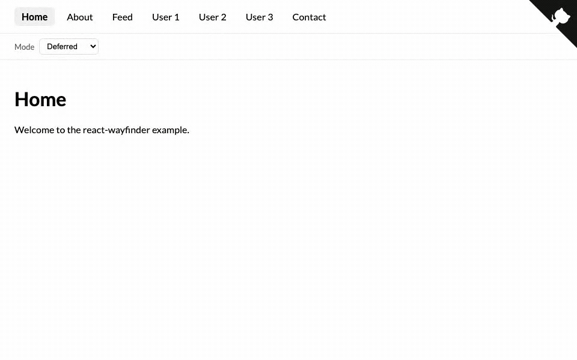

<div align="center">


Strongly-typed React router built on the [Navigation API](https://web.dev/blog/baseline-navigation-api). No outlets, no nesting &mdash; just routes, data, and a URL builder.



</div>

## Table of Contents

1. [Getting Started](#getting-started)
2. [Navigation State](#navigation-state)
3. [Programmatic Navigation](#programmatic-navigation)
4. [Redirects](#redirects)
5. [Cancellation](#cancellation)
6. [Caching](#caching)
7. [View Transitions](#view-transitions)
8. [Router Modes](#router-modes)
9. [Base Path](#base-path)
10. [Nested Routes](#nested-routes)
11. [Multi-App / Shared Components](#multi-app--shared-components)


## Getting Started

Install `react-wayfinder` using your preferred package manager:

```sh
yarn add react-wayfinder
```

Declare your URL patterns as a string `enum Routes` &mdash; one declaration site for every link in the app. Pass each route literal into `Router([...])`, which infers the urls shape from the entries' `name`/`url` pairs and returns a definition with:

- a pre-bound `<router.Router>` component (mount it directly, no `using` prop),
- a typed `router.url.X(params)` builder for every named route,
- a `router.useContext()` hook for the navigation handle.

```tsx
import { createRoot } from "react-dom/client";
import { Router, route } from "react-wayfinder";

export enum Routes {
  Home = "/",
  User = "/users/:id",
}

export const router = Router([
  route({
    name: "home",
    url: Routes.Home,
    match() {
      return <h1>Home</h1>;
    },
  }),
  route({
    name: "user",
    url: Routes.User,
    async data({ params, signal }) {
      return resources.user(params.id, { signal });
    },
    match({ status, params, data, error }) {
      if (status === "loading") return <p>Loading&hellip;</p>;
      if (status === "error")   return <p>{error.message}</p>;
      if (status === "ready")   return <User id={params.id} name={data.name} />;
      return null;
    },
  }),
]);

createRoot(document.getElementById("root")!).render(
  <router.Router />
);
```

Inside the tree, read the typed navigation handle via `router.useContext()`:

```tsx
import { router } from "./router";

function Header() {
  const context = router.useContext();
  return <a href={context.url.user({ id: "42" })}>User 42</a>;
}
```

Routes **without** a `data` function pass `params`, `url`, and `router` to `match`. Routes **with** a `data` function receive a discriminated `args` union keyed on `status` &mdash; destructure `{ status, params, data, error }` at the top and branch on `status`. TypeScript narrows the sibling `data` / `error` fields per branch (TS 5.4+ correlated-narrowing), so inside `status === "ready"` the `data` is the typed payload, inside `status === "error"` the `error` is `Error`, and neither is meaningful while `status === "loading"`. Use `"*"` as a catch-all for unmatched routes; anonymous routes (wildcards, untracked redirects) omit `name`.


## Navigation State

Wrap any navigable element in `<Route>` to get `href`, `active`, `pending`, and `handler`. For `<a>` tags, use `href` &mdash; the Navigation API intercepts the click natively. For `<button>` elements, attach `handler` as `onClick` to navigate via `navigation.navigate()`. Every `<Route>` whose `href` matches the navigation destination shows `pending: true` while a route's `data` function is running:

```tsx
import { Route } from "react-wayfinder";
import { router } from "./router";

function UserLink() {
  const context = router.useContext();

  return (
    <>
      <Route href={context.url.user({ id: 1 })}>
        {(state) => (
          <a href={state.href}>
            User 1 {state.pending ? <Spinner /> : null}
          </a>
        )}
      </Route>

      <Route href={context.url.user({ id: 1 })}>
        {(state) => (
          <button onClick={state.handler}>
            User 1 {state.pending ? <Spinner /> : null}
          </button>
        )}
      </Route>
    </>
  );
}
```

| Property | Type | Description |
|---|---|---|
| `href` | `string` | The resolved URL string &mdash; use as `href` on `<a>` tags |
| `active` | `boolean` | `true` if this href matches the currently rendered route |
| `pending` | `boolean` | `true` while navigating to this `href` |
| `handler` | `(event?) => void` | Attach as `onClick` on `<button>` elements &mdash; navigates via the Navigation API |
| `navigate` | `Navigate` | Same `push`/`replace`/`back`/`forward`/`reload` object as `context.navigate` |

Pass `replace` to `<Route>` to replace the current history entry instead of pushing a new one. This works for both `<a>` clicks and `handler` invocations:

```tsx
<Route href={context.url.signIn()} replace>
  {(state) => <a href={state.href}>Sign in</a>}
</Route>
```

`state.navigate` exposes the same `push`/`replace`/`back`/`forward`/`reload` object as `router.useContext().navigate`, so you can fire any history action straight from the render-prop and use `state.pending` to disable the link mid-fetch:

```tsx
<Route href={context.url.user({ id: 1 })}>
  {(state) => (
    <button
      disabled={state.pending}
      onClick={() => state.navigate.push(state.href)}
    >
      User 1
    </button>
  )}
</Route>
```


## Programmatic Navigation

`router.useContext()` returns a `navigate` object for navigating outside of a `<Route>`. Each method takes a pre-built href &mdash; pair it with the `url` builders to keep call sites type-safe:

```tsx
import { router } from "./router";

function NavigationButtons() {
  const context = router.useContext();

  return (
    <>
      <button onClick={() => context.navigate.push(context.url.user({ id: 1 }))}>
        Push
      </button>
      <button onClick={() => context.navigate.replace(context.url.signIn())}>
        Replace
      </button>
      <button onClick={() => context.navigate.back()}>Back</button>
      <button onClick={() => context.navigate.forward()}>Forward</button>
      <button onClick={() => context.navigate.reload()}>Refresh</button>
    </>
  );
}
```

| Method | Behaviour |
|---|---|
| `navigate.push(href)` | Push a new history entry (the default action). |
| `navigate.replace(href)` | Swap the current history entry in place &mdash; useful for canonicalisation and login redirects. |
| `navigate.back()` | Traverse one entry back, equivalent to the browser back button. |
| `navigate.forward()` | Traverse one entry forward. |
| `navigate.reload()` | Re-run the current route's `data` function &mdash; same URL, no new history entry. |

The same `context` handle is passed to every route's `match` and `redirect` callback &mdash; so you can navigate type-safely from places where hooks aren't available.

If you'd rather not import a specific `router` definition, use the standalone `useRouter<U>()` hook. Pass your routes type as the generic to get fully-typed builders without binding to a particular host:

```tsx
import { useRouter } from "react-wayfinder";
import type { Routes } from "@app/router";

function Header() {
  const context = useRouter<typeof Routes>();
  return <a href={context.url.home()}>Home</a>;
}
```


## Redirects

Return `<Redirect href="...">` from a route's `match` callback to replace the current history entry with another URL. Use it as a catch-all or to canonicalise an incomplete URL. `<Redirect>` runs the navigation once on mount via `useEffect`, so re-renders of the surrounding `<Activity>` don't re-fire it.

```tsx
import { Router, Redirect, route } from "react-wayfinder";

export enum Routes {
  Cat = "/cats/:index",
}

export const router = Router([
  route({
    name: "cat",
    url: Routes.Cat,
    match({ params }) {
      return <Viewer index={Number(params.index)} />;
    },
  }),
  route({
    url: "/cats",
    match: () => <Redirect href={router.url.cat({ index: 0 })} />,
  }),
  route({
    url: "*",
    match: () => <Redirect href={router.url.cat({ index: 0 })} />,
  }),
]);
```

`<Redirect>` always uses `history: "replace"`, so the browser back button skips the redirected-from URL. Pair it with `router.url.X(...)` to keep targets type-safe — no `as` cast required.


## Cancellation

Every `data` function receives an `AbortSignal` via `signal`. The signal is aborted when:

- The user presses **Escape** during a pending navigation
- A new navigation supersedes the current one (clicking User 2 while User 1 is loading)

```tsx
async data({ params, signal }) {
  const response = await fetch(`/api/users/${params.id}`, { signal });
  return response.json();
}
```

When cancelled, the router restores the previous route and URL &mdash; no stale state. Escape only fires when a `data` function is in-flight; pressing Escape after navigation completes does nothing.


## Caching

Every `data` function receives `cache` &mdash; the previously loaded data for that route, or `undefined` on first visit. The router always calls `data`; you decide the caching strategy:

```tsx
async data({ params, signal, cache }) {
  if (cache) return cache;
  const response = await fetch(`/api/users/${params.id}`, { signal });
  return response.json();
}
```

Previously visited routes are preserved in the DOM using React [`<Activity>`](https://react.dev/reference/react/Activity) &mdash; their component state, scroll position, and form inputs survive navigation. The example app's `/feed` route demonstrates this: scroll down to load more items via the infinite-scroll `data` function, navigate away, then come back &mdash; your scroll position and every loaded item are still there.


## View Transitions

The router automatically wraps route swaps in `document.startViewTransition()` when the browser supports it. It sets `data-direction="forward"` or `data-direction="back"` on `<html>` so you can style direction-aware animations with CSS:

```css
:root {
  --transition-duration: 250ms;
}

[data-direction="forward"]::view-transition-old(root) {
  animation: slide-out-left var(--transition-duration) ease-in-out;
}
[data-direction="forward"]::view-transition-new(root) {
  animation: slide-in-from-right var(--transition-duration) ease-in-out;
}

[data-direction="back"]::view-transition-old(root) {
  animation: slide-out-right var(--transition-duration) ease-in-out;
}
[data-direction="back"]::view-transition-new(root) {
  animation: slide-in-from-left var(--transition-duration) ease-in-out;
}
```

Direction is detected via the Navigation API &mdash; `"back"` when traversing to a lower history index, `"forward"` otherwise. Cancel clears the `data-direction` attribute to prevent unwanted animations.


## Router Modes

The `mode` prop on `<router.Router>` controls how the router transitions between routes that fetch data:

```tsx
<router.Router mode="deferred" />
```

| Mode | Behaviour |
|---|---|
| `"deferred"` (default) | Keeps the previous page on screen while the `data` function runs. Inline spinners via `<Route>` show on the clicked element. |
| `"immediate"` | Switches to the new route immediately with `status: "loading"` so you can render skeletons. Escape restores the previous route from the preserved `<Activity>`. |


## Base Path

When deploying to a sub-path (e.g. `https://example.com/my-app/`), pass `base` to `<router.Router>` so the router strips the prefix before matching &mdash; route patterns stay root-relative. The base is also baked into every `context.url.X(...)` builder so call sites never need to remember to prefix manually:

```tsx
<router.Router base={import.meta.env.BASE_URL} />
```

```tsx
function Link() {
  const context = router.useContext();
  // with base="/app", builders return base-prefixed paths automatically
  return <a href={context.url.user({ id: 42 })}>User 42</a>; // "/app/users/42"
}
```


## Nested Routes

`<Route>` can be nested freely. A top-level navigation bar uses `<Route>` for each link, and the page it renders can nest its own `<Route>` instances for sub-navigation. Each `<Route>` independently tracks `active` and `pending` for its own `href`:

```tsx
function Contact() {
  const context = router.useContext();

  return (
    <>
      <nav>
        <Route href={context.url.home()}>
          {(state) => <a href={state.href} className={state.active ? "active" : ""}>Home</a>}
        </Route>
        <Route
          href={context.url.contact({ method: "email" })}
          active={(path) => path.startsWith("/contact")}
        >
          {(state) => <a href={state.href} className={state.active ? "active" : ""}>Contact</a>}
        </Route>
      </nav>

      <nav>
        <Route href={context.url.contact({ method: "email" })}>
          {(state) => <a href={state.href} className={state.active ? "active" : ""}>Email</a>}
        </Route>
        <Route href={context.url.contact({ method: "telephone" })}>
          {(state) => <a href={state.href} className={state.active ? "active" : ""}>Telephone</a>}
        </Route>
      </nav>
    </>
  );
}
```

The top-level "Contact" link uses a custom `active` predicate so it stays highlighted regardless of which sub-tab is selected. Each nested `<Route>` uses the default exact match.


## Multi-App / Shared Components

In a monorepo where multiple apps share React components, those components can't import a single `router` definition &mdash; each app declares its own `Routes` enum. Use `shared.useContext<U>()` and pass the **union of `typeof Routes`** as the generic:

```tsx
// apps/web/router.ts
import { Router, route } from "react-wayfinder";

export enum Routes {
  Home = "/",
  Dashboard = "/dashboard",
}

export const router = Router([
  route({ name: "home", url: Routes.Home, match: () => /* ... */ null }),
  route({ name: "dashboard", url: Routes.Dashboard, match: () => /* ... */ null }),
]);
```

```tsx
// apps/mobile/router.ts — symmetrical, different routes
export enum Routes {
  Home = "/",
  Profile = "/profile",
}
```

```tsx
// shared/header.tsx — works under any host
import { shared } from "react-wayfinder";
import * as web from "@app/web/router";
import * as mobile from "@app/mobile/router";

type AnyRoutes = typeof web.Routes | typeof mobile.Routes;

export function Header() {
  const context = shared.useContext<AnyRoutes>();
  return <a href={context.url.home()}>Home</a>; // present in both arms — no narrowing needed
}
```

### Narrowing with `is*App` type guards

When a shared component needs to render app-specific links, write a type guard per host and let TypeScript narrow the routes union to a single arm. The guard inspects the runtime handle and returns a `context is Router<typeof web.Routes>` predicate &mdash; everything inside the `if` block then sees one concrete set of routes:

```tsx
import type { Router } from "react-wayfinder";
import * as web from "@app/web/router";
import * as mobile from "@app/mobile/router";

type AnyRoutes = typeof web.Routes | typeof mobile.Routes;

// `Dashboard` only exists on the web app — that's our discriminator
function isWebApp(context: Router<AnyRoutes>): context is Router<typeof web.Routes> {
  return "dashboard" in context.url;
}

function isMobileApp(context: Router<AnyRoutes>): context is Router<typeof mobile.Routes> {
  return "profile" in context.url;
}

export function ContextLink() {
  const context = shared.useContext<AnyRoutes>();

  if (isWebApp(context)) {
    // narrowed to Router<typeof web.Routes>
    return <a href={context.url.dashboard()}>Dashboard</a>;
  }

  if (isMobileApp(context)) {
    return <a href={context.url.profile()}>Profile</a>;
  }

  return null;
}
```

For the **same key with different params** across apps, every builder also carries its source pattern on `.pattern`. Compare the literal inside an `is*App` guard to keep the narrowing centralised:

```tsx
enum SoloRoutes { User = "/users/:id" }
enum TeamRoutes { User = "/teams/:tid/users/:uid" }

function isSoloApp(
  context: Router<typeof SoloRoutes | typeof TeamRoutes>,
): context is Router<typeof SoloRoutes> {
  return context.url.user.pattern === "/users/:id";
}
```

Reach for `shared.useContext` **only** when a component must support more than one host. Single-app code should stick with `router.useContext()` &mdash; the routes are captured automatically and the call site is one generic shorter.
